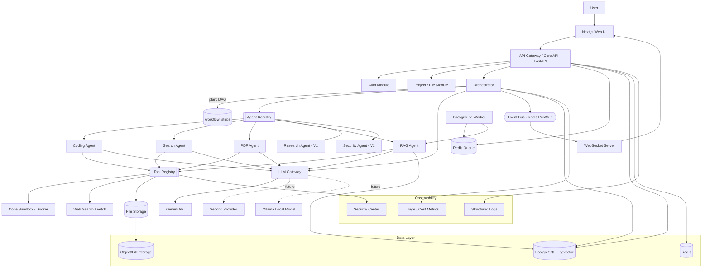

# PROJECT BLUEPRINT V1
### Multi-Agent AI Command Center — Full Architecture & Roadmap

> Status: **Planning stage.** No code has been written yet. This document is the single source of truth before Build Mode begins.

---

## 1. PROJECT NAMES (20+)

| # | Name | Meaning / Fit | Positioning | Tagline seed |
|---|------|----------------|--------------|----------------|
| 1 | **Nexora** | "Nexus" stylized — a point where agents converge | Futuristic/dev | "Where agents converge." |
| 2 | **Orchestra AI** | Direct metaphor: orchestrator conducting agents | Enterprise | "One conductor. Many instruments." |
| 3 | **Cognivo** | Cognitive + "-ivo" (active, alive) | Research/enterprise | "Intelligence, orchestrated." |
| 4 | **AgentForge** | Agents are "forged"/built here | Developer | "Forge your AI workforce." |
| 5 | **Synapzo** | Synapse (connection between neurons/agents) | Futuristic | "Every request, fully connected." |
| 6 | **Commandra** | Command + suffix implying a system/platform | Enterprise/command-center | "Command your AI team." |
| 7 | **Multivarq** | Multi + variable/quorum, sounds technical | Developer/research | "Many minds, one answer." |
| 8 | **NexoraAI** | Nexus + Aurora — convergence + emergence | Enterprise/futuristic | "The convergence of intelligence." |
| 9 | **Taskweave** | Weaving multiple task threads into one output | Developer | "Weave tasks into results." |
| 10 | **Cortexa** | Cortex (brain) + fem. suffix, sounds like a real platform | Enterprise | "Your AI command cortex." |
| 11 | **Swarmlyne** | Swarm intelligence + streamlined | Futuristic | "Intelligence that swarms to solve." |
| 12 | **OpsMind AI** | Operations + mind, sounds like a serious ops tool | Enterprise | "One mind. Every operation." |
| 13 | **Delegatio** | Latin-root "delegate" — orchestrator delegates to agents | Research/enterprise | "Delegate to intelligence." |
| 14 | **Fluxagent** | Flux (flow of data/tasks) + agent | Developer | "Where tasks flow through agents." |
| 15 | **Meridian AI** | Meridian = a line of convergence, high point | Enterprise | "Your intelligence meridian." |
| 16 | **Panoptic AI** | Panoptic = seeing everything at once (oversight/orchestration) | Enterprise/security | "See every agent. Control every task." |
| 17 | **Hivelogic** | Hive-mind + logic, playful but technical | Developer | "Hive-mind intelligence, on demand." |
| 18 | **Aegis Command** | Aegis = protection/shield, ties into security angle | Security/enterprise | "Command AI. Protected by design." |
| 19 | **Synthex** | Synthesis + "-ex" tech suffix | Developer/futuristic | "Synthesize intelligence." |
| 20 | **Vantra AI** | Vantage + "-tra" — a command vantage point | Enterprise/futuristic | "Your vantage point over AI." |
| 21 | **Quorum AI** | Quorum = minimum agents needed to act, ties into multi-agent | Research | "A quorum of specialists, one voice." |
| 22 | **RelayMind** | Relay = passing tasks agent to agent | Developer | "Minds in relay." |

### Top 5
1. **Nexora** — short, brandable, unused-sounding, works as a domain and a logo mark.
2. **Cortexa** — sounds like an existing serious AI company; strong enterprise ring.
3. **Commandra** — most literally matches "AI Command Center," easy elevator pitch.
4. **AgentForge** — developer-first, self-explanatory, great for GitHub/portfolio framing.
5. **Panoptic AI** — strong security/oversight narrative, distinctive metaphor.

### FINAL DECISION: **Nexora**
Chosen by the founder. "Nexora" reads as Nexus (convergence point) + Aurora (emergence/dawn) — fitting for a platform where a single command converges into a coordinated agent response. Used throughout the rest of this document and all subsequent build phases.

*(Original blueprint recommendation was "Nexora" — superseded by this decision.)*

### 20 Taglines
1. "One Command. A Team of AI Agents."
2. "Your AI Team, Orchestrated."
3. "One question. Many minds. One answer."
4. "Where a single command becomes a coordinated team."
5. "AI that delegates, not just answers."
6. "Not one model. A workforce."
7. "You lead. The agents execute."
8. "Intelligence, orchestrated end-to-end."
9. "One prompt in. A synthesized answer out."
10. "Command the agents. Own the outcome."
11. "Multiply your intelligence, not your effort."
12. "The AI command center for complex work."
13. "Specialists on demand, synthesized on arrival."
14. "Give it a goal. It builds the team."
15. "One brain to plan. Many hands to execute."
16. "From command to conclusion — autonomously."
17. "Your personal AI department."
18. "Ask once. Agents handle the rest."
19. "The orchestration layer for real AI work."
20. "Beyond chat. Into execution."

---

## 2. PRODUCT VISION

**Product Vision:** Nexora is an AI Command Center where a single natural-language command is decomposed by an orchestrator agent, routed to a team of specialized agents (coding, research, search, RAG, documents, data, security, writing), executed with real tool access, validated, and synthesized into one coherent, cited, trustworthy result — visible to the user in real time as it happens.

**Product Mission:** Make complex, multi-step knowledge work (research, document analysis, coding tasks, security review) as easy as issuing one command, by giving the user visibility into — and control over — an AI workforce instead of a single black-box chatbot.

**Target Users:**
- Students/researchers who need multi-source research synthesized into a report.
- Developers who want an AI system that reviews/tests/documents code with real tool execution, not just text suggestions.
- Small teams/analysts doing document-heavy work (contracts, PDFs, spreadsheets) who need retrieval-grounded answers with citations.
- (Portfolio audience) Recruiters/interviewers evaluating your systems-design and AI-engineering ability.

**Core Problem:** Single-model chat interfaces (ChatGPT/Claude/Gemini web UIs) are optimized for one-shot conversation, not for: task decomposition, parallel specialized execution, tool use with permissions, retrieval across a private knowledge base, or transparent multi-step execution with audit trails.

**Solution:** An orchestration layer that plans, routes, executes, validates, and synthesizes — with a UI that visualizes the agent network working in real time, rather than hiding everything behind a spinner.

**Why multiple agents are useful:** Specialization improves reliability (a narrow coding agent with a code-execution tool outperforms a general model asked to "write and mentally simulate code"), enables parallelism (search + RAG + security can run simultaneously), and allows independent permissioning (a research agent shouldn't have file-delete rights; a coding agent shouldn't send emails).

**Why this differs from ChatGPT/Claude/Gemini:** Those are single-agent conversational products. Nexora is an orchestration *system* — it exposes planning, delegation, tool permissions, and execution state as first-class UI, and it's built around your own knowledge base and workflows rather than a generic chat history.

**Why it's technically impressive (portfolio angle):** It touches distributed systems (microservices, queues, events), applied AI (RAG, tool calling, structured output, model routing), security engineering (prompt-injection defense, sandboxing, permissioning), and product-grade frontend engineering (real-time visualization, design systems) — in one coherent, demoable system. That combination is rare even in junior/mid-level industry roles.

**Why portfolio-worthy:** It's not "wrap an API in a chat UI." It has a defensible system design, security model, and a UI that visually proves the backend architecture is real — this is exactly what a hiring panel wants to see: can you design and reason about a real distributed AI system, not just call an API.

**How it becomes a SaaS product:** Free/Pro/Developer/Enterprise tiers gated by agent-run quotas, storage limits, API access, and advanced agents — architecture described in §71.

**USP:** Transparent, controllable, multi-agent execution with real tool access and RAG — visualized live — instead of an opaque single-model chat box.

**Competitive Differentiation:** ChatGPT/Gemini/Claude apps = single-agent conversation. AutoGPT-style tools = agent automation with poor UX and no security model. Nexora = production-grade orchestration **and** a premium, trustworthy UI **and** an explicit security/permission layer.

---

## 3. CORE PRODUCT CONCEPT

```
USER
 ↓
ORCHESTRATOR (understands intent, classifies task)
 ↓
PLAN (breaks into subtasks, decides sequential vs parallel)
 ↓
AGENT SELECTION (via Agent Registry)
 ↓
EXECUTION (agents call tools, retrieve knowledge, use data)
 ↓
VALIDATION (schema-checked structured outputs)
 ↓
SYNTHESIS (orchestrator/synthesizer combines agent outputs)
 ↓
FINAL RESPONSE (with citations + execution trace)
```

**Core concept, one line:** *One user. One command. Many agents. One intelligent result.*

---

## 4. AGENT ORCHESTRATION ARCHITECTURE — EVALUATION & RECOMMENDATION

| Pattern | Description | Verdict |
|---|---|---|
| Pure Supervisor (single router) | One LLM call decides everything, no explicit plan artifact | Too fragile for multi-step tasks |
| **Planner/Executor (recommended core)** | Planner LLM produces an explicit structured plan (list of subtasks + dependencies); Executor runs each subtask via the right agent | Transparent, debuggable, matches "safe execution display" requirement |
| Hierarchical agents (agents that spawn sub-agents) | Powerful but hard to bound/secure; overkill for MVP | Defer to V2+ |
| **Graph-based workflow (recommended for execution)** | Plan is represented as a DAG (nodes = agent tasks, edges = dependencies); supports parallel branches naturally | Matches Workflow Builder (§31) exactly — same engine powers both auto-planning and manual building |
| State machine per workflow run | Each run has explicit states (`PLANNED → RUNNING → AGENT_X_DONE → VALIDATING → SYNTHESIZED → DONE/FAILED`) | Use this **underneath** the graph model for persistence/recovery |
| Event-driven | Agents emit events consumed by a bus; UI and workers subscribe | Use for real-time UI (§21), not as the sole orchestration model |

**Recommendation:** **Planner/Executor producing a DAG, persisted as a state machine, executed via an event bus.**
- The Orchestrator LLM call always outputs a **structured plan** (JSON: list of tasks, each with `agent`, `inputs`, `depends_on`).
- The plan is stored as rows in `workflow_steps` (a DAG in the DB).
- A lightweight executor walks the DAG: runs all steps whose dependencies are satisfied (parallel where possible), updates step status, and emits events for each transition.
- This is *the same execution engine* used by both auto-generated plans (chat) and user-built workflows (Workflow Builder) — one system, two ways to create the DAG. This avoids building two orchestration engines.

Why not pure hierarchical agents for MVP: they multiply security surface area (agent-spawns-agent means permissions must propagate correctly) and are much harder to visualize/debug for a portfolio demo where transparency is the whole point.

---

## 5. AGENTS — MVP / V1 / FUTURE SPLIT

| Agent | MVP | V1 | Future |
|---|---|---|---|
| Orchestrator | ✅ Required | Plan repair/retry logic | Multi-orchestrator (per-project) |
| Coding Agent | ✅ (generate, explain, basic sandboxed run) | Debug, refactor, test-gen, repo analysis | Full repo-aware agent |
| Search Agent | ✅ | Source ranking, citation collection | Multi-engine fusion |
| PDF/Document Agent | ✅ (parse, extract, summarize) | Table extraction, comparison | Multi-doc diffing |
| RAG/Knowledge Agent | ✅ (ingest, embed, retrieve, cite) | Hybrid search, reranking, metadata filters | Cross-project knowledge graphs |
| Research Agent | ❌ | ✅ (subquestions, cross-check, synthesis) | Autonomous long-horizon research |
| Data Analysis Agent | ❌ | ✅ (CSV/Excel, SQL gen, charts) | Full BI layer |
| Writer/Report Agent | ❌ | ✅ | Style/brand-tuned generation |
| Security Agent | ❌ (baseline security is platform-level, not agent-level, in MVP) | ✅ (URL/prompt-injection/sensitive-data analysis) | Continuous monitoring agent |

**MVP agent count: 4 (Orchestrator, Coding, Search, PDF) + RAG as the 5th** — enough to prove multi-agent orchestration, tool use, and RAG without overbuilding.

---

## 6. AGENT REGISTRY

`agents` table (see §17) doubles as the registry. Each agent record:

```json
{
  "agent_id": "search-agent",
  "name": "Search Agent",
  "version": "1.0.0",
  "description": "Finds and ranks web sources for a query",
  "capabilities": ["web_search", "source_ranking", "citation_extraction"],
  "supported_tasks": ["search", "fact_lookup"],
  "tools": ["search_web", "fetch_page", "extract_content"],
  "permissions": ["network:read"],
  "model": "gemini-2.5-flash",
  "status": "active",
  "cost_profile": "low",
  "avg_latency_ms": 2200,
  "success_rate": 0.97
}
```

The Orchestrator queries the registry at plan time (`SELECT * FROM agents WHERE status='active' AND 'search' = ANY(supported_tasks)`) — **adding an agent means inserting a registry row + implementing its handler behind a shared interface, never touching Orchestrator code.** This is enforced by a common `Agent` interface in the `agent-sdk` package (§77): `async def run(task: Task) -> AgentResult`.

---

## 7. AGENT VERSIONING

- `agent_versions` table: `agent_id, version, config_json, prompt_id, created_at, is_active`.
- Only one version per `agent_id` is `is_active=true` at a time; Orchestrator always resolves the active version.
- Rollback = flip `is_active` back to a prior version row (no redeploy needed if prompt/config-only change).
- `agent_runs` records which exact version handled each run → enables version-level success-rate/latency/cost comparison (powers §73 Agent Evaluation Center).
- A/B testing (V2+): route a % of traffic to a challenger version, compare `agent_runs` metrics before promoting.

---

## 8. TOOL SYSTEM

Central `tools` table + a `ToolSchema` (JSON Schema for inputs/outputs) per tool, enforced before execution.

```
ToolRegistry
 ├── register(tool_id, schema, handler, required_permission, timeout_s)
 ├── validate(tool_id, input) → raises on schema mismatch
 ├── execute(tool_id, input, agent_context) → checks permission, runs handler with timeout, logs to tool_calls
```

Example tools by agent (MVP subset in **bold**):
- Coding: **read_file, write_file, execute_code (sandboxed)**, search_code, run_tests, git_diff
- Search: **search_web, fetch_page**, extract_content
- PDF: **parse_pdf, extract_text**, extract_tables, generate_pdf
- RAG: **search_documents, retrieve_chunks**, rerank_chunks
- Data (V1): read_csv, analyze_dataframe, generate_chart

Every tool call: validated against schema → permission-checked against the calling agent's permission set → executed with a hard timeout → logged to `tool_calls` (success/failure, duration, sanitized input/output) → errors returned as structured failures the Orchestrator can retry/repair, never raw stack traces to the LLM.

---

## 9. PERMISSION MATRIX (excerpt)

| Agent | Can | Cannot |
|---|---|---|
| Coding Agent | Read/write files within its own project sandbox; execute code in sandbox; run tests | Read secrets/env vars; access other users' projects; reach the internet from inside the sandbox; touch production |
| Search Agent | Make outbound HTTP GET to allow-listed search/fetch endpoints | Execute code; write files; access the database directly |
| PDF Agent | Read files user uploaded to the current project | Write outside its output directory; access other projects |
| RAG Agent | Query vector DB scoped to `project_id`/`user_id` | Query another user's/project's vectors under any circumstance |
| Security Agent | Read logs, analyze URLs/text | Execute code, modify permissions, take autonomous action |
| Orchestrator | Read the plan, dispatch to agents, read agent outputs | Directly call arbitrary tools (must go through an agent) |

Trust levels (§53) gate which actions require human approval (§54) — e.g., any HIGH-trust tool call (`execute_code`, external API writes) is queued for approval in MVP-plus if the action is destructive.

---

## 10. AI MODEL / API KEY STRATEGY — THE MOST IMPORTANT SECTION FOR YOU AS A STUDENT

**Core principle: one LLM Gateway service, one primary provider for MVP, keys never touch the frontend.**

```
Frontend (Next.js) → Backend/API Gateway → LLM Gateway service → LLM Provider(s)
```

The LLM Gateway is the *only* thing holding provider API keys (as server-side env vars). It exposes one internal interface — `generate(prompt, model_tier, response_schema=None) -> LLMResponse` — that every agent calls. Agents never know which provider is behind `model_tier`.

### Provider comparison

| Provider | Cost | Free tier | Tool calling | Structured output | Context | Embeddings | Verdict |
|---|---|---|---|---|---|---|---|
| **Google Gemini** | Very low / generous free tier (Flash) | Yes — best free tier for students | Yes | Yes (JSON mode) | Large (1M on Pro) | Yes (text-embedding-004) | **Primary MVP provider** — cheapest path to a fully working system |
| Anthropic Claude | Higher cost, small free trial credit | Limited | Yes, strong | Yes | Large | No native embedding model | Great quality; use sparingly for complex reasoning/coding tasks if budget allows |
| OpenAI | Moderate cost | Small trial credit | Yes | Yes | Good | Yes (text-embedding-3-small, cheap) | Solid alternative; use if you specifically need their embeddings or already have credits |
| Open-source (Llama/Mistral via API) | Low (hosted) / free (self-hosted) | Varies | Weaker/inconsistent tool calling | Weaker | Varies | Varies | Consider for a "local model" demo feature, not primary path |
| Ollama (local) | Free (your hardware) | N/A | Basic | Weak | Small models only | Yes (nomic-embed-text) | Great for the "Private/Local Model" routing demo — proves you understand cost/privacy tradeoffs, not for main workloads |

### Can one provider support all agents? 
**Yes for MVP.** Gemini alone can power Orchestrator planning, Coding, Search summarization, PDF summarization, and RAG generation, *and* its embedding model, with one API key. This is the single most important cost decision: **you do not need 5 different provider keys for 5 agents.** Route by *model tier*, not by *provider*, and only reach for a second provider when you specifically want to demonstrate multi-provider routing/fallback (a nice-to-have V1 feature, not an MVP requirement).

### Exact keys to create for MVP

| Key | Purpose | Required for MVP? |
|---|---|---|
| `GEMINI_API_KEY` | All LLM calls + embeddings, via LLM Gateway only | ✅ Yes — this is essentially your only AI key |
| `SEARCH_API_KEY` (e.g. Tavily free tier, or Serper) | Search Agent's `search_web` tool | ✅ Yes, one key |
| `JWT_SECRET` | Auth token signing | ✅ Yes (self-generated, not a provider key) |
| `DATABASE_URL` | PostgreSQL connection | ✅ Yes |
| `REDIS_URL` | Cache/queue connection | ✅ Yes |
| `S3_*` / object storage creds | File storage (or local disk for pure MVP) | Optional for MVP (local disk is fine to start) |
| `OPENAI_API_KEY` / `ANTHROPIC_API_KEY` | Second provider for fallback/routing demo | ❌ Not required for MVP — add in V1 when demonstrating model routing |

**Category separation (important discipline):**
- **AI API keys**: `GEMINI_API_KEY` (and optionally a second provider later).
- **Search API keys**: separate from AI keys — a search provider (Tavily/Serper/Bing) key.
- **Embedding credentials**: same as AI key if using Gemini's embedding model (no separate key needed).
- **Vector DB credentials**: none needed for MVP if using **pgvector** (it's just Postgres — see §14).
- **Database credentials**: `DATABASE_URL`.
- **Auth secrets**: `JWT_SECRET`, `REFRESH_TOKEN_SECRET`.
- **Application secrets**: session secret, webhook signing secret (V1+).

**Bottom line for MVP: 2 real external API keys (Gemini + one search API), everything else is infrastructure you control.**

---

## 11. MODEL ROUTING

Rule-based routing for MVP (cheap, predictable, explainable in an interview) — not AI-based routing (adds cost/latency to save cost, ironic for MVP):

```
Task classification (from Orchestrator's plan) → tier:
  "simple lookup / classification"      → gemini-flash-lite  (cheapest/fastest)
  "general agent task (search/PDF/RAG)" → gemini-flash        (default workhorse)
  "complex reasoning / orchestrator plan" → gemini-pro         (used sparingly)
  "coding generation"                    → gemini-flash (MVP) / claude (V1, if budget allows — best coding quality)
  "embeddings"                           → text-embedding-004
  "explicitly marked private/local"      → ollama local model (V1 demo feature)
```

V1 evolution: add **capability-aware + cost-aware** scoring (weigh latency, $/1K tokens, and required context length) instead of hard-coded task→tier mapping — still rule-based, just with a small scoring function instead of a lookup table. Full AI-based routing (an LLM deciding which LLM to call) is a nice V2 flex feature but not worth the added cost for MVP.

---

## 12. COST CONTROL

- **Caching**: cache identical `(prompt_hash, model)` LLM calls and search results (Redis, TTL-based) — huge free win for repeated demo runs.
- **Token limits**: hard `max_tokens` per agent call; truncate/paginate RAG context to a fixed chunk budget.
- **Batch embeddings**: embed in batches during ingestion, not one chunk per call.
- **Rate limiting**: per-user request limits (protects your own free tier from being exhausted, or abused if you ever put this online publicly).
- **Model routing** (§11) is itself the biggest cost lever — most calls should hit the cheapest tier.
- **Tracking**: every LLM/tool call writes to `api_usage` (tokens in/out, estimated cost, latency) → powers the Usage Dashboard (§49) with zero extra work later.

---

## 13. RAG ARCHITECTURE

```
Upload → File Service → Parser (per file type) → Text Extraction → Cleaning
 → Chunking (semantic, ~500-800 tokens, 10-15% overlap) → Metadata tagging
 → Embedding (batched) → Vector DB (pgvector) → [Query time] Retrieval (top-k)
 → Reranking (optional, V1) → Context Assembly (dedupe + budget-limited)
 → LLM generation → Answer + Citations (chunk provenance preserved end-to-end)
```

- **Chunk size**: 500–800 tokens, ~15% overlap — good balance of context vs. noise for report/PDF-style documents.
- **Metadata**: `document_id, project_id, user_id, page_number, chunk_index` on every chunk — used for filtering *and* citation rendering.
- **Hybrid search (V1)**: combine vector similarity with keyword (Postgres full-text) search, since pure embedding similarity misses exact terms (names, codes, numbers).
- **Reranking (V1)**: cross-encoder rerank of top-20 vector hits down to top-5 before sending to the LLM — meaningfully improves answer grounding.
- **Query rewriting (V1)**: expand a short user query into a more retrieval-friendly form before embedding.
- **Citations**: every answer references chunk IDs; UI resolves them to source cards (§39).

### Vector DB choice

| Option | Verdict |
|---|---|
| **pgvector (recommended for MVP and honestly V1 too)** | It's an extension on the Postgres you already run — zero new infrastructure, zero new credentials, fully sufficient at student/portfolio scale, and it *proves* you understand you don't need a separate vector DB just because it's trendy |
| Qdrant | Great, but a second service to run/secure/deploy for no real benefit at this scale |
| Pinecone | Managed but adds an external dependency + another API key + cost |
| Weaviate / Milvus | Enterprise scale — unnecessary complexity for this project size |

**Decision: pgvector.** This is a deliberate "don't overbuild" decision you should be ready to explain in interviews — a strength, not a shortcut.

---

## 14. MEMORY ARCHITECTURE

| Layer | Contents | Storage | Lifecycle |
|---|---|---|---|
| Short-Term | Current conversation turns | `messages` table, scoped to `conversation_id` | Cleared/archived when conversation ends or on user delete |
| Long-Term | Explicit user preferences/facts (not auto-scraped from every message) | `user_memories` table, each row user-visible and deletable | Created only on clear signals (explicit "remember this") or user-approved suggestions — never silently inferred and stored |
| Knowledge | Uploaded docs/knowledge bases | `documents` + `chunks` (vector) | Deleted with the knowledge base; strictly project/user scoped |

User controls: view all long-term memories, delete individually, clear all, export. No memory is created without a clear, attributable trigger — avoids the "creepy black box" failure mode and keeps this legally/ethically clean for a public portfolio demo.

---

## 15. DATABASE ARCHITECTURE (PostgreSQL)

Core entities and relationships (abbreviated ERD — full DDL comes in Phase 6):

```
organizations (id, name, plan, created_at)
  └─< users (id, org_id, email, password_hash, role, created_at)
        └─< sessions (id, user_id, refresh_token_hash, expires_at)
        └─< api_keys (id, user_id, key_hash, permissions, last_used_at, expires_at)
        └─< projects (id, user_id, org_id, name, created_at)
              └─< conversations (id, project_id, title, created_at)
                    └─< messages (id, conversation_id, role, content, created_at)
              └─< knowledge_bases (id, project_id, name)
                    └─< documents (id, kb_id, filename, status, uploaded_at)
                          └─< chunks (id, document_id, content, embedding VECTOR, metadata JSONB)
              └─< workflows (id, project_id, name, definition JSONB, created_at)
                    └─< workflow_steps (id, workflow_id, agent_id, depends_on[], status, input, output)
              └─< files (id, project_id, path, mime_type, size, uploaded_at)

agents (id, name, description, capabilities[], status)
  └─< agent_versions (id, agent_id, version, config JSONB, prompt_id, is_active)
        └─< agent_runs (id, agent_version_id, workflow_step_id, status, latency_ms, cost, created_at)

tools (id, name, schema JSONB, required_permission)
  └─< tool_calls (id, agent_run_id, tool_id, input JSONB, output JSONB, status, duration_ms)

tasks (id, workflow_id, status, created_at)  -- top-level user-facing job record
audit_logs (id, user_id, action, resource, risk_level, created_at)
permissions (id, subject_type, subject_id, resource, action)
notifications (id, user_id, type, payload JSONB, read_at)
webhooks (id, user_id, url, event_type, secret_hash, active)
api_usage (id, user_id, agent_run_id, tokens_in, tokens_out, estimated_cost, created_at)
```

**Multi-tenant note:** `org_id` exists on `users`/`projects` from day one even though MVP only ever creates a personal default org per user — this means adding real team workspaces later is a data migration, not a schema redesign. **Indexes:** foreign keys, `chunks(document_id)`, `chunks USING ivfflat (embedding)` for ANN search, `agent_runs(agent_version_id, created_at)` for the eval dashboard, `audit_logs(user_id, created_at)`.

---

## 16. VECTOR DATA ISOLATION

Every `chunks` row carries `project_id` and (transitively) `user_id`. **Every retrieval query filters by `project_id` in the SQL/vector query itself — never in application code after the fact.** This is the single most important RAG security rule: isolation must be enforced at the query layer, not the presentation layer.

---

## 17. MICROSERVICES — MVP vs V1

**MVP (deliberately consolidated):**
- `api-gateway` + `auth` + `project/file services` → **one FastAPI backend service** ("core-api"). Splitting these into 4 services on day one is the classic over-engineering mistake for a solo project — you'd spend your semester on service discovery instead of features.
- `orchestrator` — its own logical module inside the same backend initially, but written with a clean internal interface so it *can* be extracted later.
- Each **agent** is a Python class/module behind the shared `Agent` interface, run in-process by the orchestrator for MVP (no network hop per agent call) — this alone removes an enormous amount of infra complexity while still fully demonstrating multi-agent architecture.
- `worker` — a **separate** process (Celery/RQ workers) for anything long-running (embeddings, PDF parsing) — this one *should* be separate from day one since it's the natural home for background jobs.

**V1 (start separating):**
- Extract `rag-service` (embedding + retrieval) into its own service once you want independent scaling/deployment — good moment to demonstrate "why we split this out" in your docs.
- Extract `orchestrator` into its own service once agents need independent scaling or you want to run agents as separate containers (nice V1 milestone: "agents as isolated processes" ties directly into the sandboxing story).

**Recommendation to state explicitly in your README:** *"We intentionally run a modular monolith for MVP and extract services only when there's a concrete scaling or isolation reason — this is itself a system-design decision, not a limitation."* This is a genuinely strong thing to say in an interview.

---

## 18. EVENT-DRIVEN / QUEUE ARCHITECTURE

**Choice for MVP: Redis (as both cache and queue via RQ or Celery+Redis broker).** RabbitMQ/Kafka are more powerful but are unjustified operational overhead at this scale — Redis is already required for caching/sessions, so it does double duty with zero extra infrastructure. Revisit Kafka only if you later want to demonstrate event-sourcing/streaming specifically.

- **Queues**: `embeddings`, `pdf_processing`, `workflow_execution`.
- **Workers**: consume jobs, execute, write status to `tasks`/`workflow_steps`.
- **Retries**: exponential backoff, max 3 attempts, then move to a dead-letter queue key.
- **Idempotency**: every job carries an `idempotency_key` (e.g., `document_id + version`) so re-processing a retried job doesn't double-insert chunks.
- **Job status**: polled via `GET /tasks/{id}` and/or pushed via the event bus to WebSocket clients.

---

## 19. REAL-TIME AGENT EXECUTION

```
Agent/Orchestrator emits domain event (e.g. AGENT_STARTED)
 → published to a Redis pub/sub channel scoped to workflow_id
 → backend WebSocket handler (or SSE) subscribed to that channel
 → pushed to the specific connected frontend client
```

Event types (exactly as you listed): `TASK_CREATED, AGENT_SELECTED, AGENT_STARTED, TOOL_STARTED, TOOL_COMPLETED, AGENT_COMPLETED, AGENT_FAILED, WORKFLOW_COMPLETED, FINAL_RESPONSE_READY`. **WebSocket over SSE** is the recommendation, since you'll want bidirectional communication later (approvals, workflow pause/resume) — SSE would need a second channel for that.

---

## 20. UI/UX DESIGN DIRECTION

**Visual style:** Dark-first premium theme, near-black background (`#0A0A0F`-ish), single accent color used sparingly (electric blue or violet), soft 1px borders instead of heavy shadows, glass/blur used only on overlays (command palette, modals) — not on every card. Typography: one geometric sans (e.g., Inter/Geist) for UI, one monospace (e.g., JetBrains Mono) for code/logs. Agent iconography: minimal line icons, one consistent stroke weight, status conveyed by color + shape (not extra icons) — ○ idle, ● active (pulsing), ✓ complete, ! failed, ◌ waiting.

**Avoid:** neon glow everywhere, gradient-on-every-card, rounded-corner overload, motion on things that don't need it (a completed task shouldn't keep animating).

**3 branding directions (pick one, recommend below):**
1. **Enterprise AI** — muted navy/graphite, conservative, "Palantir-lite."
2. **Developer AI** — terminal-inspired accents, monospace-forward, "Vercel/Linear-lite."
3. **Futuristic Intelligence** — deep space background, subtle particle/network motifs, one glowing accent — "the AI command center" feeling.

**Recommendation: Futuristic Intelligence, restrained.** It matches the Agent Network visualization concept (§26) best, but must be executed with *restraint* — one accent color, no more than one glow element on screen at a time — otherwise it slides into "generic AI startup template," which is exactly what you're told to avoid.

---

## 21. PREMIUM ANIMATION STRATEGY

- **Framer Motion** for all React component transitions (page transitions, card hover/enter, modal/toast in-out) — small, purposeful, 150–250ms.
- **SVG + CSS** for the Agent Network graph's idle/active/complete state changes (a pulsing ring on "active," a checkmark draw-in on "complete") — cheaper than a JS animation library for many simultaneous small animations.
- **React Flow**'s built-in edge/animated-edge support for the Workflow Builder and delegation-line animations (§27) — don't hand-roll this.
- Respect `prefers-reduced-motion`: fall back to instant state changes + color only.
- Rule of thumb stated explicitly in your dev rules: *if an animation doesn't communicate a state change, cut it.*

---

## 22. AI COMMAND CENTER / AGENT NETWORK VISUALIZATION

Central node = Orchestrator. Surrounding nodes = active agents for the current run (agents not involved in this task simply aren't drawn, to avoid clutter). Edges animate directionally: solid pulsing line while a task is delegated/running, edge "completes" (turns solid, non-animated) with a small checkmark when the agent returns its result. Parallel branches (search + RAG + security simultaneously) are rendered as simultaneous animated edges from the orchestrator — visually this is the single most convincing proof that "multi-agent" isn't just marketing copy.

**Safe execution display:** only high-level, pre-approved status strings are ever shown (`"Planning task", "Selecting Research Agent", "Searching 8 sources", "Retrieving relevant knowledge", "Generating report"`) — these are emitted by the code around the LLM call (deterministic strings tied to pipeline stage), never the model's raw chain-of-thought. This is a hard architectural rule, not a prompting trick.

**Activity Timeline** (§29) is simply a chronological list of the same events already on the event bus — no separate data model needed.

---

## 23. WORKFLOW BUILDER DESIGN

Built on **React Flow / XYFlow**. Node types: Agent node, Tool node, Condition node, Human-Approval node. Each node has typed input/output handles; edges represent data flow + execution order (same DAG structure that backs auto-generated plans, per §4). Saving a workflow serializes the graph to `workflows.definition` (JSONB: nodes + edges). Executing a saved workflow instantiates `workflow_steps` rows exactly like an auto-planned run — **one execution engine, two authoring paths** (chat-generated or hand-built).

Templates (§32) are just pre-populated `definition` JSON, seeded at first run — zero extra backend work.

---

## 24. API ARCHITECTURE

Prefix: `/api/v1`. REST, JSON, JWT bearer auth. Representative surface:

```
POST   /auth/register
POST   /auth/login
POST   /auth/refresh
POST   /chat                          (creates/continues a conversation → triggers orchestrator)
GET    /conversations
GET    /conversations/{id}
GET    /agents
GET    /agents/{id}
POST   /agents/run                    (direct single-agent invocation, used internally + advanced users)
POST   /files/upload
POST   /knowledge-bases
POST   /knowledge-bases/{id}/documents
POST   /knowledge-bases/{id}/query
POST   /workflows
GET    /workflows/{id}
POST   /workflows/{id}/execute
GET    /tasks/{id}                    (poll status; also mirrored over WebSocket)
GET    /usage
POST   /api-keys
DELETE /api-keys/{id}
POST   /webhooks
```

Every endpoint has a Pydantic request/response schema (auto-generates OpenAPI docs via FastAPI for free — put this straight into your portfolio as live API docs).

---

## 25. SECURITY ARCHITECTURE

**Application security:** JWT (short-lived access + refresh token), bcrypt/argon2 password hashing, RBAC (`USER`/`ADMIN` for MVP), Pydantic input validation on every endpoint, strict CORS allow-list, per-IP and per-user rate limiting, standard secure headers (CSP, HSTS, X-Content-Type-Options), file upload validation (type allow-list, size cap, sanitized filenames, stored outside the web root with randomized names).

**AI security (the differentiated part of this project):**
- **Prompt-injection defense**: input scanned by a lightweight classifier/heuristic *before* it reaches an agent (pattern + LLM-based detector for injection markers); agent tool permissions are enforced independently of what the LLM "decides" — the security boundary is code, not the prompt. This is the critical point to state clearly: **the system does not rely on the LLM to police itself.**
- **Tool allow-lists per agent** (§9) enforced in the Tool Registry, not by trusting agent output.
- **Output validation**: every agent must return a schema-conformant structured object (§28); malformed output triggers a repair retry, never silently passes through.
- **Sensitive-data detection**: scan outbound tool inputs/outputs for obvious secret patterns (API keys, tokens) before logging or displaying.
- **Agent sandboxing**: code execution never touches the host (§56).
- **SSRF/URL validation**: any tool that fetches a URL validates against a private-IP/localhost block-list before making the request.

---

## 26. SECURITY CENTER & AI SECURITY MONITOR

`audit_logs` + a `security_events` table (event_type, agent_id, risk_level, blocked: bool, details) power a dashboard showing: Authentication/API/Agent-Permissions/Data-Isolation health indicators, recent security events (blocked prompt-injection attempts, malicious URLs rejected, rate-limit hits, failed logins), and a rolling security score. This doubles as one of your strongest demo screens — it's the section that visibly proves "AI security" isn't just a bullet point.

---

## 27. HUMAN-IN-THE-LOOP & TRUST LEVELS

Trust levels: LOW (calculator, summarizer — auto-run), MEDIUM (search, file read — auto-run with logging), HIGH (code execution, external writes, email — **requires approval** in any workflow, MVP-plus). Approval = a `workflow_steps.status = 'awaiting_approval'` row + a notification; the DAG executor simply pauses that branch until an approval API call flips the status.

---

## 28. CODE EXECUTION SANDBOX

**MVP:** Docker container per execution, no network, read-only mounted code, strict CPU/memory/time limits, non-root user, ephemeral (destroyed after run). **Production-grade (V2+ note in docs, not built in MVP):** Firecracker microVMs or gVisor for stronger isolation guarantees — explicitly documented as a "known upgrade path" so you can speak to it in interviews even if you don't build it.

---

## 29. DEVELOPMENT ROADMAP (Phases, condensed — full detail delivered phase-by-phase in Build Mode)

| Phase | Objective | Key output |
|---|---|---|
| 0 | Product definition (this document) | Approved blueprint |
| 1 | Repo setup, monorepo skeleton, env conventions | Repo builds, `docker-compose up` runs empty shell |
| 2 | Design system (Tailwind theme, shadcn components, tokens) | Storybook-less but reusable component set |
| 3 | Frontend foundation (Next.js app shell, routing, auth pages) | Login/register UI (no backend yet) |
| 4 | Backend foundation (FastAPI skeleton, health check, config) | `/health` returns 200 |
| 5 | Authentication (JWT, register/login/refresh, RBAC) | Real login works end-to-end |
| 6 | Database (Postgres schema, migrations, models) | All core tables exist |
| 7 | LLM Gateway (Gemini integration, one `generate()` call) | Backend can call Gemini and return text |
| 8 | First agent (Search Agent, one tool) | `/agents/run` returns a real search-grounded answer |
| 9 | Orchestrator (planner producing a DAG) | A chat message produces a multi-step plan |
| 10 | Tool system (registry, schemas, permissions) | Tools are pluggable, validated, logged |
| 11 | PDF Agent | Upload → parse → summarize |
| 12 | RAG (pgvector, chunking, embeddings, retrieval) | Ask a question grounded in an uploaded doc |
| 13 | Coding Agent + sandbox | Code generated and safely executed |
| 14 | Multi-agent workflows (parallel DAG execution) | Search + RAG run in parallel, synthesized |
| 15 | Real-time agent network (WebSocket + event bus) | Live UI shows agents lighting up |
| 16 | Worker/queue (Redis + RQ/Celery) | Embeddings/PDF processing run in background |
| 17 | Security layer (injection defense, sandbleveling, audit log) | Security Center shows real data |
| 18 | Workflow Builder (React Flow) | User can hand-build and run a workflow |
| 19 | Research Agent + Data Agent + Writer Agent (V1 agents) | Full agent roster online |
| 20 | Observability (structured logs, basic metrics) | Usage dashboard populated from real data |
| 21 | Testing (unit + integration + a few agent/security tests) | CI green |
| 22 | CI/CD (GitHub Actions) | Push → lint/test/build pipeline |
| 23 | Docker polish + docker-compose prod profile | One-command full-stack spin-up |
| 24 | Cloud deployment (student-friendly host) | Live public demo URL |
| 25 | UI polish, motion pass, landing page | Portfolio-ready visuals |
| 26 | Demo mode, portfolio page, docs, README | Ready to publish/share |

Each phase, in Build Mode, will be expanded with: objective, exact files, commands, code, env vars, how to run, how to test, common errors, and Definition of Done — exactly as you specified in §96 of your prompt.

---

## 30. MVP BOUNDARY (explicit)

**In MVP:** Auth, Dashboard, AI Workspace (chat), Orchestrator (planner→DAG→executor), Search Agent, PDF Agent, RAG Agent, Coding Agent (basic sandboxed run), PostgreSQL + pgvector, Redis (cache+queue), basic tool calling with permissions, sequential + basic parallel workflows (auto-planned only, no visual builder yet), real-time agent network visualization, Docker Compose, baseline security (auth, validation, sandboxing, basic prompt-injection check, audit log), basic observability (structured logs + usage table).

**Explicitly NOT in MVP:** Research/Data/Writer/Security agents, visual Workflow Builder, agent marketplace, custom agents, Developer API/webhooks, billing, team workspaces, advanced RAG (hybrid/rerank), multi-provider routing, local models. These are all clearly staged in V1/V2 (§92–94 in your original spec) and won't block a working, demoable MVP.

---

## 31. PORTFOLIO DIFFERENTIATION

What makes this stand out versus 95% of "AI chatbot" student projects: (1) an explicit, inspectable execution plan rather than a hidden prompt chain, (2) real tool-permission enforcement in code, not just in a prompt, (3) a security center with real blocked-event data, (4) a documented, justified decision *not* to over-engineer (modular monolith, pgvector instead of a separate vector DB, Redis instead of Kafka) — reviewers respect restraint backed by reasoning far more than a pile of unused technologies.

---

## 32. DEMO SCENARIOS (10)

1. **Deep Research Report** — "Research current cybersecurity threats and produce a cited PDF." → Search → Research → RAG → Writer → PDF.
2. **Code Review & Fix** — "Review my project, fix bugs, generate tests." → Coding → Sandbox → Testing → Report.
3. **Knowledge Base Q&A** — Upload 15–20 PDFs, ask "what are the common recommendations across these?" → PDF → Embed → Vector Search → RAG → Synthesis.
4. **Cybersecurity Investigation** — Search → Research → Security → RAG → Report.
5. **Parallel Multi-Agent Brief** — one query fans out to Search + RAG + Security simultaneously, then synthesizes.
6. **Prompt-Injection Live Block** — feed a document containing an injection attempt; Security Center shows it detected and blocked in real time.
7. **Data Insight** — upload a CSV, ask for trends + a chart. → Data Agent → SQL/pandas → chart.
8. **Custom Workflow Save & Reuse** — build a workflow visually, run it, save it, re-run later with different inputs.
9. **Human-in-the-loop Approval** — a workflow step requiring code execution pauses for explicit user approval before continuing.
10. **API/Developer Demo** — call `POST /api/v1/workflows/execute` directly with an API key, showing the same engine powering an external integration.

---

## 33. FINAL ARCHITECTURE DIAGRAM (Mermaid)



---

## 34. WHAT HAPPENS NEXT

This blueprint covers naming, vision, architecture, security, cost strategy, UI direction, and the phased roadmap. Nothing has been coded. Once you review and approve (or request changes to) this document, we switch into **Build Mode** and start at **Phase 0/1**: repo scaffolding, exactly as scoped in §29 — one phase at a time, with full working code, run instructions, and a Definition of Done before moving forward.
